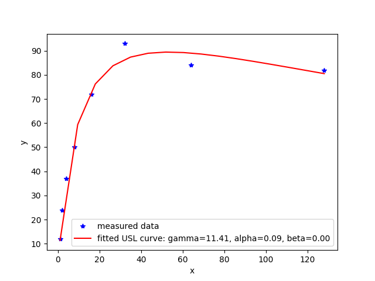

# pyusl
Universal Scalability Law in Python

## Background

The original derivation of the Universal Scalability Law, or USL, was presented at the 1993 CMG conference by the computer scientist [Neil J. Gunther](https://en.wikipedia.org/wiki/Neil_J._Gunther). The law is an extension to the serial fraction concept contained in [Amdahl's law](https://en.wikipedia.org/wiki/Amdahl%27s_law). Let `X(N)` be the capacity or throughput of the system at a given load `N`, the USL states that
```
                              gamma  *  N                      
X(N)   =   -------------------------------------------------------
            1  +   alpha  *  (N − 1)  +  beta  *  N  *  (N − 1)
```
where α, β, γ sometimes called "the three Cs", are defined as the following (cited from [Gunther's blog](http://www.perfdynamics.com/Manifesto/USLscalability.html)):
* Concurrency (gamma) or ideal parallelism, which represents the slope associated with linear-rising scalability.
* Contention (with proportion alpha) due to waiting or queueing for shared resources.
* Coherency (with proportion beta) due to the delay for data to become consistent (or coherent) by virtue of point-to-point exchange of data between resources that are distributed.



## Required packages
* matplotlib (for result plotting)
* numpy (for numeric computation)
* scipy (for curve fitting)

## Required test package
* nose (for unit testing)

## To install the package
```
sudo pip install pyusl
```

## To run a quick demo
```
cd examples
python example1.py
```

## To run tests
```
python setup.py test
```
or if you have nose installed, simply call
```
nosetests
```
in the project folder.

## Instructions for pyusl
### General usage
You can create a pyusl instance with no input:
```
from pyusl import usl
u = usl()
```
It has the following three public properties, and their default values are:
* (Concurrency) gamma = 1
* (Contention) alpha = 0
* (Coherency) beta = 0

You can create a model by assigning the parameter values through the constructor, for example:
```
u = usl(3, 4, 5)
```

You can evaluate the USL model by the `compute` method:
```
x = [1,2,3,4,7]
y = u.compute(x)
```
You can plot `x` and `y` to get a rough sketch of the USL curve. Alternatively, you can call the `plot` method in pyusl:
```
u.plot(x)
```
### Fit a model

To fit a USL model with given `x`, `y` data sets, simply call `fit`. For example:
```
x = [1, 2, 3]
y = [7, 10, 12]
u.fit(x, y)
```
By default, a matplotlib plot will be generated and shown at the end, to turn this feature off, assign `requires_plot` to false:
```
u.fit(x, y, requires_plot = False)
```
You can also pass in the initial guess value for gamma, alpha and beta for better curve fitting:
```
u.fit(x, y, initial_guess = [0.5, 1, 1.2])
```
After calling fit, you can always plot the curve by using the `plot` method:
```
u.plot()
```
Notice you don't need to pass in an `x` value because by default it will use the `x` passed in for fitting. The raw `x` and `y` data can be accessed via:
```
u.rawx
u.rawy
```
